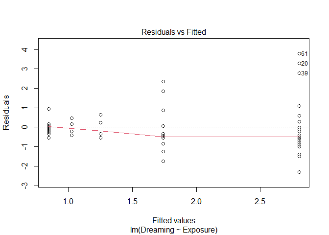
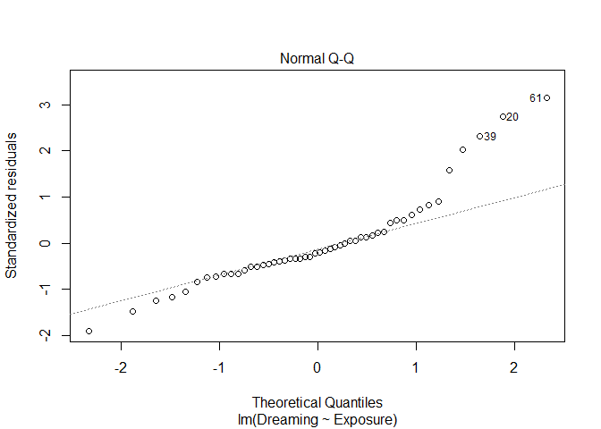
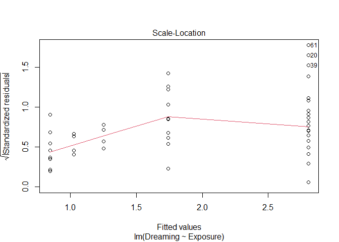
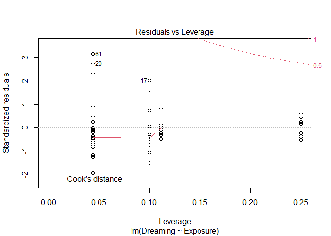
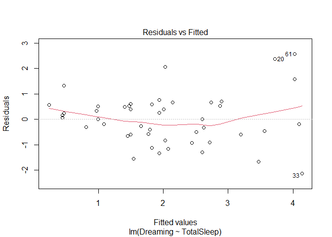
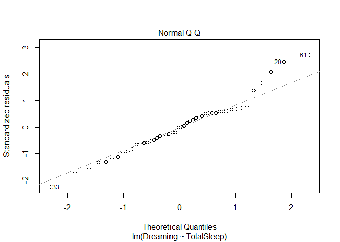
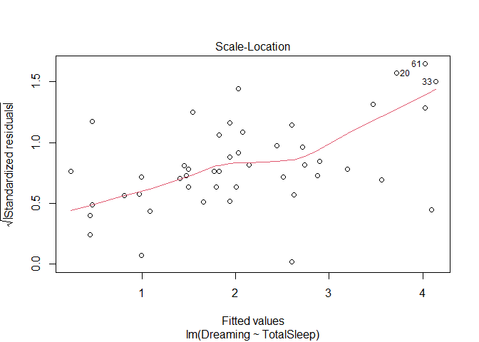
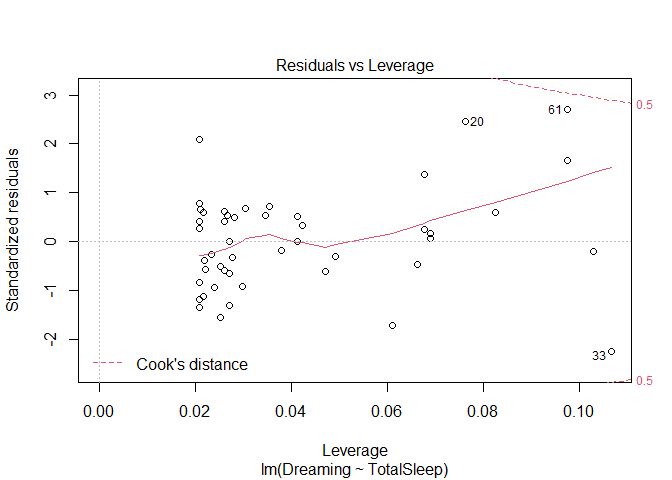

For instructions, see 
[this file](https://docs.google.com/document/d/1s_Y3O69ei2xLlYc-JPnvQtH6Ci_OH_Bdk4BvnuodJ5Q/edit?usp=sharing){target="blank"} 


THIS TEMPLATE IS DESIGNED TO HELP GUIDE YOUR PROJECT DEVELOPMENT. YOU CAN CHANGE
OR ADD ANY SECTIONS, BUT I NEED A BRIEF BACKGROUND (WHAT IS YOUR QUESTION, WHY,
WHAT DOES THE DATA LOOK LIKE?). THEN YOU NEED TO IMPORT THE DATA, CHECK IT, PERFORM
EDA, RUN AND INTERPRET TESTS, DEVELOP APPROPRIATE PLOTS, AND THEN BRIEFLY SUMMARIZE
YOUR FINDINGS.

# Background and metadata

What is the main goal of your project? How did you collect the data? You can copy
this to/from a paper.

# Read in (Import) your data

Useful functions here may be **read.csv**.

# Check your data

Useful functions here may be **str**, **summary**, or **head**.

# Exploratory data analysis

Useful functions here may come from the **ggplot2** package.

# Run statistical tests

## One sample tests

Options here include binomial tests (for discrete data) and z test, t tests, and
sign tests for continuous data. You can also use bootstrapping.

## Two sample tests

Options here included /chi^2 tests (for discrete data) and t tests, Wilcoxon tests, 
and sign tests. You can also use bootstrapping and permutation tests.  Make sure 
to consider if your data are paired!

## Linear models

We will typically focus on linear models. The most useful function here is
**lm**; it covers most tests from classical statistics.

The assumptions for all linear models 
are that the residuals are independently and identically distributed and follow 
a normal distribution.

Once you create the **lm** object, check it for assumptions using **plot(object)**.
What you want to see 

* is no pattern in first graph (Residuals vs fitted)
  * a pattern (like a funnel shape) means the residuals are increasing with the mean value, so you may need a transformation
* the dots falling on the line in the second graph (the Normal Q-Q).  this is a qq plot; if the lines fall along the line it means the normality assumption is ok
* no outliers in the 4th plot (Residuals vs Leverage); this identifies plots that are high leverage (removing/including them really changes your results). you may want to check these.

Despite all this, lm's are very robust and are often used in ecology.

### ANOVA example (comparing numerical data from categories)


```r
#example of anova
sleep <- read.csv("https://raw.githubusercontent.com/jsgosnell/CUNY-BioStats/master/datasets/sleep.csv", stringsAsFactors = T)
sleep$Exposure <- factor(sleep$Exposure)
sleep_by_exposure_lm <- lm(Dreaming~Exposure, sleep)
plot(sleep_by_exposure_lm)
```

<!-- --><!-- --><!-- --><!-- -->

```r
library(car)
```

```
## Loading required package: carData
```

```r
Anova(sleep_by_exposure_lm, type = "III")
```

```
## Anova Table (Type III tests)
## 
## Response: Dreaming
##              Sum Sq Df  F value    Pr(>F)    
## (Intercept) 180.880  1 119.0120 3.175e-14 ***
## Exposure     33.588  4   5.5248  0.001049 ** 
## Residuals    68.393 45                       
## ---
## Signif. codes:  0 '***' 0.001 '**' 0.01 '*' 0.05 '.' 0.1 ' ' 1
```
If you get a significant p-value and you have more than 2 levels, an obvious 
question is which levels are different. Talk to me about exploring this with


```r
library(multcomp)
```

```
## Loading required package: mvtnorm
```

```
## Loading required package: survival
```

```
## Loading required package: TH.data
```

```
## Loading required package: MASS
```

```
## 
## Attaching package: 'TH.data'
```

```
## The following object is masked from 'package:MASS':
## 
##     geyser
```

```r
comparison <- glht(sleep_by_exposure_lm, linfct = mcp(Exposure = "Tukey"))
summary(comparison)
```

```
## 
## 	 Simultaneous Tests for General Linear Hypotheses
## 
## Multiple Comparisons of Means: Tukey Contrasts
## 
## 
## Fit: lm(formula = Dreaming ~ Exposure, data = sleep)
## 
## Linear Hypotheses:
##            Estimate Std. Error t value Pr(>|t|)   
## 2 - 1 == 0  -1.0643     0.4670  -2.279  0.16268   
## 3 - 1 == 0  -1.7793     0.6679  -2.664  0.07156 . 
## 4 - 1 == 0  -1.5543     0.6679  -2.327  0.14787   
## 5 - 1 == 0  -1.9599     0.4847  -4.043  0.00168 **
## 3 - 2 == 0  -0.7150     0.7293  -0.980  0.85602   
## 4 - 2 == 0  -0.4900     0.7293  -0.672  0.95922   
## 5 - 2 == 0  -0.8956     0.5664  -1.581  0.50372   
## 4 - 3 == 0   0.2250     0.8717   0.258  0.99892   
## 5 - 3 == 0  -0.1806     0.7408  -0.244  0.99914   
## 5 - 4 == 0  -0.4056     0.7408  -0.547  0.98058   
## ---
## Signif. codes:  0 '***' 0.001 '**' 0.01 '*' 0.05 '.' 0.1 ' ' 1
## (Adjusted p values reported -- single-step method)
```

### Regression example (looking for relationships among numerical data)


```r
#example of regression
dreaming_by_sleep_lm <- lm(Dreaming~TotalSleep, sleep)
plot(dreaming_by_sleep_lm)
```

<!-- --><!-- --><!-- --><!-- -->

```r
Anova(dreaming_by_sleep_lm, type = "III")
```

```
## Anova Table (Type III tests)
## 
## Response: Dreaming
##             Sum Sq Df F value    Pr(>F)    
## (Intercept)  1.330  1  1.3236    0.2559    
## TotalSleep  51.858  1 51.5931 4.849e-09 ***
## Residuals   46.236 46                      
## ---
## Signif. codes:  0 '***' 0.001 '**' 0.01 '*' 0.05 '.' 0.1 ' ' 1
```

```r
#summary is good to get the coefficients
summary(dreaming_by_sleep_lm)
```

```
## 
## Call:
## lm(formula = Dreaming ~ TotalSleep, data = sleep)
## 
## Residuals:
##      Min       1Q   Median       3Q      Max 
## -2.13701 -0.59744  0.00226  0.53371  2.57766 
## 
## Coefficients:
##             Estimate Std. Error t value Pr(>|t|)    
## (Intercept) -0.42685    0.37102  -1.150    0.256    
## TotalSleep   0.22934    0.03193   7.183 4.85e-09 ***
## ---
## Signif. codes:  0 '***' 0.001 '**' 0.01 '*' 0.05 '.' 0.1 ' ' 1
## 
## Residual standard error: 1.003 on 46 degrees of freedom
##   (14 observations deleted due to missingness)
## Multiple R-squared:  0.5287,	Adjusted R-squared:  0.5184 
## F-statistic: 51.59 on 1 and 46 DF,  p-value: 4.849e-09
```

# Publication-quality graphs

# Brief discussion
