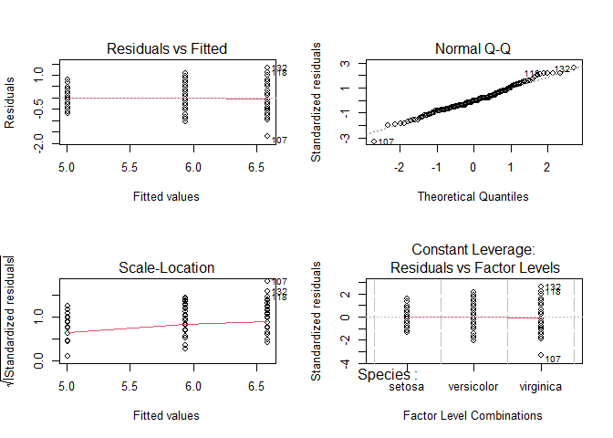

Before doing this, review the **7. ANOVA and multiple comparisons** lecture set slides from 
https://sites.google.com/view/biostats/lessons/anova-and-multiple-comparisons and
the  **7_ANOVAs.R** script in the lecture files folder of the
[CUNY-BioStats github repository](https://github.com/jsgosnell/CUNY-BioStats).
Make sure you are comfortable with null and alternative hypotheses and approiate plots
for all examples.


Remember you should

* add code chunks by clicking the *Insert Chunk* button on the toolbar or by
pressing *Ctrl+Alt+I* to answer the questions!
* **knit** your file to produce a markdown version that you can see!
* save your work often 
  * **commit** it via git!
  * **push** updates to github
  
## Examples  

We will run ANOVA's using the *lm* function to connect them to other test.  First,
build the model


```r
iris_anova <- lm(Sepal.Length~Species, iris)
```

Then use the object it created to test assumptions


```r
par(mfrow = c(2,2))
plot(iris_anova)
```

<!-- -->

If assumptions are met, check the p-value using the *summary* or *Anova* function.


```r
summary(iris_anova)
```

```
## 
## Call:
## lm(formula = Sepal.Length ~ Species, data = iris)
## 
## Residuals:
##     Min      1Q  Median      3Q     Max 
## -1.6880 -0.3285 -0.0060  0.3120  1.3120 
## 
## Coefficients:
##                   Estimate Std. Error t value Pr(>|t|)    
## (Intercept)         5.0060     0.0728  68.762  < 2e-16 ***
## Speciesversicolor   0.9300     0.1030   9.033 8.77e-16 ***
## Speciesvirginica    1.5820     0.1030  15.366  < 2e-16 ***
## ---
## Signif. codes:  0 '***' 0.001 '**' 0.01 '*' 0.05 '.' 0.1 ' ' 1
## 
## Residual standard error: 0.5148 on 147 degrees of freedom
## Multiple R-squared:  0.6187,	Adjusted R-squared:  0.6135 
## F-statistic: 119.3 on 2 and 147 DF,  p-value: < 2.2e-16
```

```r
library(car)
```

```
## Warning: package 'car' was built under R version 4.1.3
```

```
## Loading required package: carData
```

```
## Warning: package 'carData' was built under R version 4.1.3
```

```r
Anova(iris_anova, type = "III")
```

```
## Anova Table (Type III tests)
## 
## Response: Sepal.Length
##              Sum Sq  Df F value    Pr(>F)    
## (Intercept) 1253.00   1 4728.16 < 2.2e-16 ***
## Species       63.21   2  119.26 < 2.2e-16 ***
## Residuals     38.96 147                      
## ---
## Signif. codes:  0 '***' 0.001 '**' 0.01 '*' 0.05 '.' 0.1 ' ' 1
```

If the overall test is significant, carry out post hoc tests (Tukey shown here
for all pairs, as most common)


```r
library(multcomp)
```

```
## Loading required package: mvtnorm
```

```
## Loading required package: survival
```

```
## Loading required package: TH.data
```

```
## Loading required package: MASS
```

```
## 
## Attaching package: 'TH.data'
```

```
## The following object is masked from 'package:MASS':
## 
##     geyser
```

```r
compare_cont_tukey <- glht(iris_anova, linfct = mcp(Species = "Tukey"))
summary(compare_cont_tukey)
```

```
## 
## 	 Simultaneous Tests for General Linear Hypotheses
## 
## Multiple Comparisons of Means: Tukey Contrasts
## 
## 
## Fit: lm(formula = Sepal.Length ~ Species, data = iris)
## 
## Linear Hypotheses:
##                             Estimate Std. Error t value Pr(>|t|)    
## versicolor - setosa == 0       0.930      0.103   9.033   <1e-08 ***
## virginica - setosa == 0        1.582      0.103  15.366   <1e-08 ***
## virginica - versicolor == 0    0.652      0.103   6.333   <1e-08 ***
## ---
## Signif. codes:  0 '***' 0.001 '**' 0.01 '*' 0.05 '.' 0.1 ' ' 1
## (Adjusted p values reported -- single-step method)
```

If assumptions are not met, we can use the Kruskal Wallis non-parametric test and 
associated post hoc tests.


```r
kruskal.test(Sepal.Length ~ Species, data = iris)
```

```
## 
## 	Kruskal-Wallis rank sum test
## 
## data:  Sepal.Length by Species
## Kruskal-Wallis chi-squared = 96.937, df = 2, p-value < 2.2e-16
```

```r
pairwise.wilcox.test(iris$Sepal.Length, 
                          iris$Species, 
                          p.adjust.method="holm")
```

```
## 
## 	Pairwise comparisons using Wilcoxon rank sum test with continuity correction 
## 
## data:  iris$Sepal.Length and iris$Species 
## 
##            setosa  versicolor
## versicolor 1.7e-13 -         
## virginica  < 2e-16 5.9e-07   
## 
## P value adjustment method: holm
```

or a bootstrap alternative


```r
library(WRS2)
```

```
## Warning: package 'WRS2' was built under R version 4.1.3
```

```r
t1waybt(Sepal.Length~Species, iris)
```

```
## Call:
## t1waybt(formula = Sepal.Length ~ Species, data = iris)
## 
## Effective number of bootstrap samples was 599.
## 
## Test statistic: 111.9502 
## p-value: 0 
## Variance explained: 0.716 
## Effect size: 0.846
```

```r
bootstrap_post_hoc <- mcppb20(Sepal.Length~Species, iris)
p.adjust(as.numeric(bootstrap_post_hoc$comp[,6]), "holm")
```

```
## [1] 0 0 0
```

## Just for practice 

*Do this problems using ANOVA, Kruskal-Wallis, and 
bootstrapping methods.  Make sure you can plot the data and carry out multiple 
comparison methods as needed. Also be sure to understand the use of coefficients 
and adjusted R^2^ values and where to find them.* 

### 1

1. Use the iris dataset in R to determine if petal length differs among species.  


### 2

2. Data on plant heights (in cm) for plants grown with a new and old formulation 
of fertilizer can be found at

https://docs.google.com/spreadsheets/d/e/2PACX-1vSUVowOKlmTic4ekL7LSbwDcqrsDSXv5K_c4Qyfcvz1lLE1_iINmGzy0zMGxY7z5DImlUErK4S2wY7Y/pub?gid=0&single=true&output=csv.

Analyze this data using the t.test function and the lm function to convince yourself
that t-tests are special cases of ANOVAs, which are special cases of linear models! 


## For the following questions, pick the appropriate method for analyzing the question.  Use a plot of the data and/or model analysis to justify your decision.  Make sure you can carry out multiple comparison methods as needed. Also be sure to understand the use of coefficients and adjusted R^2^ values and where to find them.

### 3

3. Data on sugar cane yield for multiple fields is available using 

read.table("https://docs.google.com/spreadsheets/d/e/2PACX-1vRjstKreIM6UknyKFQCtw2_Q6itY9iOAVWO1hUNZkBFL8mwVssvTevqgzV22YDKCUeJq0HBDrsBrf5O/pub?gid=971470377&single=true&output=tsv", 
header = T, stringsAsFactors = T)

More info on the data can be found at 
http://www.statsci.org/data/oz/cane.html.
Is there evidence that location (DistrictPosition column) impacts yield 
(Tonn.Hect column)?  If so, which areas are driving this distance?

### 4

4. Data on FEV (forced expiratory volume), a measure of lung function, can be 
found at 

http://www.statsci.org/data/general/fev.txt

More information on the dataset is available at 

http://www.statsci.org/data/general/fev.html.

Is there evidence that FEV depends on gender? If so, which gender has the higher
FEV score?  How much variance does gender explain? 

### 5

5. A professor carried out a long-term study to see how various factors impacted
pulse rate before and after exercise.  Data can be found at

http://www.statsci.org/data/oz/ms212.txt

With more info at 

http://www.statsci.org/data/oz/ms212.html.

Is there evidence that frequency of exercise (Exercise column) impacts resting
pulse rate (Pulse1 column)?

### 6

6. Continuing with the pulse dataset, is there evidence frequency of exercise
impacts change in pulse rate?  Note we should only consider change for students 
who ran between the first and second pulse measures (Ran column = 1).

